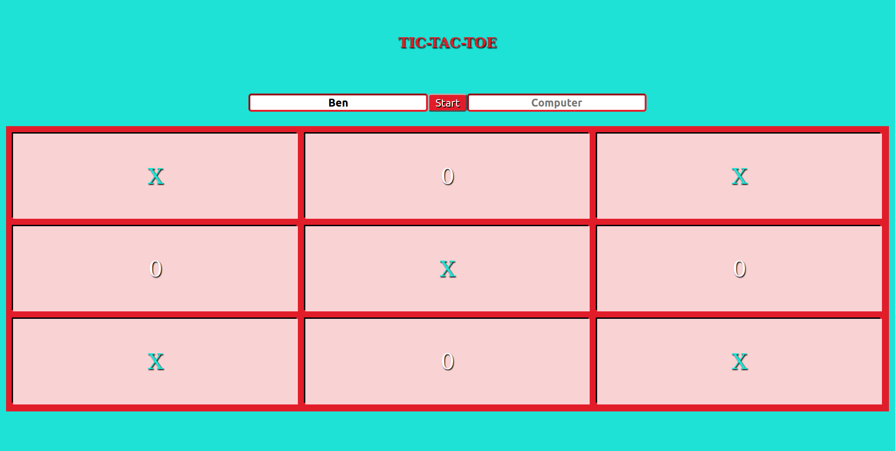

# TicTacToe
 
   A JavaScript program that allows users to play a game of TicTacToe
 

 
## Built With
 
   Javascript,  
   Html,  
   Css,  
   Eslint
 
## Getting Started
To get a local copy up and running follow these simple example steps.

Clone the repo  
Open the html file in a browser  

## How to Play
Enter your name in the textbox  
Pick the square which you want to take on your turn  
A player wins when three squares are connected  
The Characters will change color when someone has won
 
 
👤 **Sick-Carlito**
 
 Github: [@Sick-Carlito](https://github.com/Sick-Carlito)
 Twitter: [@cbond_420](https://twitter.com/cbond_420)
 Linkedin: [@CarlB420](https://www.linkedin.com/in/carlb420/)

👤 **BenjaminGarza**

 Github: [@BenjaminGarza](https://github.com/BenjaminGarza)
 Twitter: [@zeroBasedIndex](https://twitter.com/zeroBasedIndex)
 Linkedin: [@Ben Garza](https://www.linkedin.com/in/benjamin-garza/)
 
 
Contributions, issues and feature requests are welcome!
 
Feel free to check the issues page.
Show your support
 
Give a star if you like this project!

## Acknowledgments
 
  The Odin Project
 
 ## License
This project is MIT licensed.

